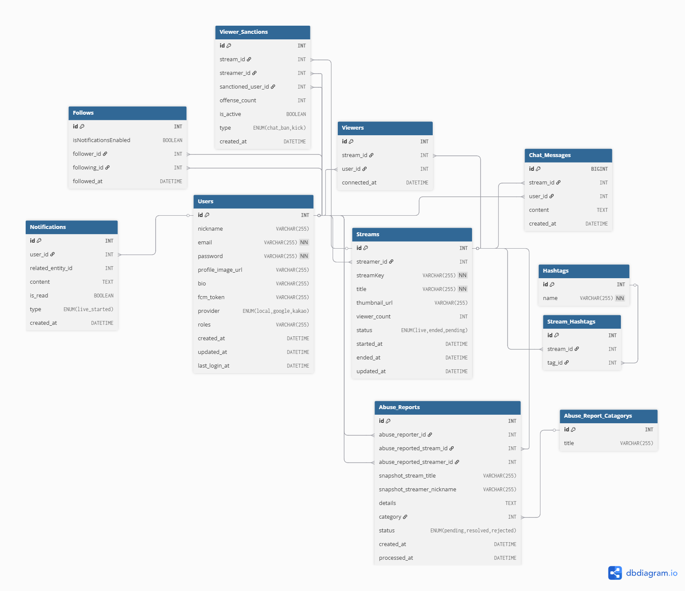

<div>


</div>

# 실무양성심화과정 - 중개플랫폼 웹/앱 : Laviu

- 자바와 스프링부트를 활용하여 Rest API 서버를 제작하였습니다.
- 전체 개발 기간 : 2025.08.04 ~ 2025.08.26
  <br />

## 앱 레퍼런싱

- 치지직, 숲 앱을 리퍼런싱 하여 제작하였습니다.


# 👥 팀 멤버

| 이름  | 역할 | GitHub                                     |
|-----|----|--------------------------------------------|
| 최재원 | 팀장 | [@jjack-1](https://github.com/jjack-1)     |
| 백하림 | 팀원 | [@harimmon](https://github.com/harimmon)   |
| 이창호 | 팀원 | [@CHLee2004](https://github.com/CHLee2004) |
| 김나희 | 팀원 | [@verynahce](https://github.com/verynahce) |

<br />

# ⚙️ 기술 스택

## 🛠️ 사용 기술

<table>
  <tr>
    <td align="center">
      <br/>
      Java
    </td>
    <td align="center">
      <br/>
      Spring Boot
    </td>
    <td align="center">
      <br/>
      RestDoc
    </td>
    <td align="center">
      <br/>
      JPA(Hibernate)
    </td>
    <td align="center">
      <br/>
      H2
    </td>
  </tr>
</table>

<table>
  <tr>
    <td align="center">
      <br/>
      Naver OAuth 2.0
    </td>
    <td align="center">
      <br/>
      Spring WebSocket (STOMP)
    </td>
    <td align="center">
      <br/>
      Spring Security
    </td>
  </tr>
</table>

## 🧰 개발 환경

<table>
    <tr>
        <td align="center"><br/>IntelliJ</td>
    </tr>
</table>

## 🤝 협업 도구

<table>
    <tr>
        <td align="center"><br/>Git</td>
        <td align="center"><br/>GitHub</td>
        <td align="center"><br/>Notion</td>
        <td align="center"><br/>Slack</td>
    </tr>
</table>

<br>

# 📋 프로젝트 업무 분담

<table style="width: 100%; text-align: start; font-size: 16px; border-collapse: collapse;">
    <thead style="background-color: #f2f2f2;">
        <tr>
            <th style="padding: 10px; border: 1px solid #ddd;">담당자</th>
            <th style="padding: 10px; border: 1px solid #ddd;">프로젝트 업무 분담</th>
        </tr>
    </thead>
    <tbody>
        <tr>
            <td style="padding: 10px; border: 1px solid #ddd;">문정준</td>
            <td style="padding: 10px; border: 1px solid #ddd;">
                <ul>
                    <li>프로젝트 계획 및 관리</li>
                    <li>팀 리딩 및 커뮤니케이션</li>
                </ul>
            </td>
        </tr>
        <tr>
            <td style="padding: 10px; border: 1px solid #ddd;">최재원</td>
            <td style="padding: 10px; border: 1px solid #ddd;">
                <ul>
                    <li>러닝 CRUD 기능 개발</li>
                    <li>러닝 레벨 기능 개발</li>
                    <li>러닝 챌린지 기능 개발</li>
                    <li>러닝 뱃지 기능 개발</li>
                    <li>kakao OIDC 구현</li>
                    <li>파이어베이스 FCM 구현</li>
                    <li>RestDoc 문서 작성</li>
                    <li>AWS CICD</li>
                </ul>
            </td>
        </tr>
        <tr>
            <td style="padding: 10px; border: 1px solid #ddd;">편준민</td>
            <td style="padding: 10px; border: 1px solid #ddd;">
                <ul>
                    <li>러닝 통계 기능 개발</li>
                    <li>러닝 리더보드 기능 개발</li>
                    <li>친구 추가 및 검색 기능 개발</li>
                    <li>챌린지 초대 및 수락 기능 개발</li>
                    <li>알림 목록 기능 개발</li>
                </ul>
            </td>
        </tr>
        <tr>
            <td style="padding: 10px; border: 1px solid #ddd;">김세리</td>
            <td style="padding: 10px; border: 1px solid #ddd;">
                <ul>
                    <li>게시글 기능 개발</li>
                    <li>댓글 기능 개발</li>
                    <li>좋아요 기능 개발</li>
                </ul>
            </td>
        </tr>
    </tbody>
</table>

# 주요 기능

### 공통

- 로그인, 회원가입
- 유효성 검사
- 인증 체크

### 러닝

- 러닝 기록 - 등록, 수정, 삭제
- 러닝 기록 - 통계 : 주간, 월간, 년간, 전체
- 러닝 기록 - 러닝레벨
- 러닝 기록 - 획득 뱃지 : 최고기록, 월간기록
- 러닝 기록 - 리더보드 : 친구들과의 누적거리 비교

### 챌린지

- 챌린지 - 등록, 수정, 삭제
- 챌린지 - 스케줄러 : 공개챌린지 생성 및 사설챌린지 보상
- 챌린지 - 보상목록
- 챌린지 - 리더보드 : 챌린지 참가자들의 누적거리 비교
- 챌린지 - 초대 : 사설챌린지에 친구를 초대할 수 있음

### 게시글

- 게시글 - 등록, 수정, 삭제
    - 게시글에 러닝 기록을 등록할 수 있음
- 댓글 - 등록, 수정, 삭제
- 좋아요 - 등록, 삭제

# ERD



```